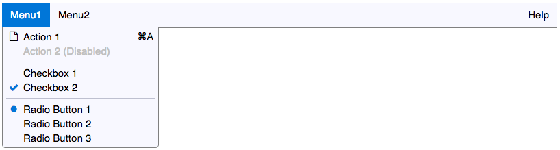
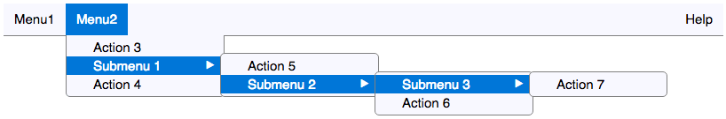

## About

This widget aims to emulate a 'real' desktop menu control as much as possible.
Highlights include:

* Supports both fixed menus defined via HTML and dynamic items modified via a JavaScript API.
* Supports up to 4 levels of hierarchical menus.
* Supports right-aligned menus.
* Includes [WAI-ARIA](http://www.w3.org/TR/wai-aria/) compliant roles.
* Full keyboard support, including menu activation hotkeys, navigation and global keyboard shortcuts.
* Platform-aware styling for OS X and Windows (including Windows 10).
* Does **not** rely on CSS hover. Menus will not appear until the user clicks on the widget and don't disappear if you accidentally mouse out of an open menu hierarchy.
* Works with IE8+, Chrome, Firefox and Safari.
* Compatible with touch devices.
* Self contained; no framework dependencies (IE8 support needs jQuery 1.3/1.4).

#### Online Demo
See it in action at [Menu Demo](http://menu.markstubbs.info/)

## Getting Started

#### Installation

##### CSS

```html
<link rel="stylesheet" type="text/css" href="/css/menu.min.css">
```

##### JavaScript

```html
<script src="/script/polyfills/Array.find.min.js"></script>
<script src="/script/utils.min.js"></script>
<script src="/script/platform.min.js"></script>
<script src="/script/menu.min.js"></script>
```

###### IE 9+ Support
Tto support IE9+ you'll also need to prepend some additional polyfills:

```html
<script src="/script/polyfills/console.min.js"></script>
<script src="/script/polyfills/classlist.min.js"></script>
```

###### IE 8+ Support
To support IE8+ you'll need to prepend a few more:

```html
<script src="/script/polyfills/console.min.js"></script>
<script src="/script/polyfills/ie8.min.js"></script>
<script src="/script/polyfills/trim.min.js"></script>
<script src="/script/polyfills/Object.keys.min.js"></script>
<script src="/script/polyfills/Array.filter.min.js"></script>
<script src="/script/polyfills/Array.indexOf.min.js"></script>
<script src="/script/polyfills/Array.isArray.min.js"></script>
<script src="/script/polyfills/Array.forEach.min.js"></script>
<script src="/script/polyfills/classlist.min.js"></script>
<script src="/script/jquery-1.11.3.min.js"></script>
<script src="/script/polyfills/selectivizr.min.js"></script>
```

#### Creating Your First Static Menu

The easiest way to create a static menu is to create a set of nested unordered lists.
Here's an example that illustrates a number of features:
```html
<ul id="menu" style="display: none">
    <li>
        menu1
        <ul>
            <li data-icon="class(fa-file-o)" data-shortcut="m a">action 1</li>
            <li aria-disabled="true">action 2 (disabled)</li>
            <li></li>
            <li role="menuitemcheckbox">checkbox 1</li>
            <li role="menuitemcheckbox" aria-checked="true">checkbox 2</li>
            <li></li>
            <li role="menuitemradio" aria-checked="true">radio button 1</li>
            <li role="menuitemradio">radio button 2</li>
            <li role="menuitemradio">radio button 3</li>
        </ul>
    </li>
    <li>
        menu2
        <ul>
            <li>action 3</li>
            <li>
                submenu 1
                <ul>
                    <li>action 5</li>
                    <li>
                        submenu 2
                        <ul>
                            <li>
                                submenu 3
                                <ul>
                                    <li>action 7</li>
                                </ul>
                            </li>
                            <li>action 6</li>
                        </ul>
                    </li>
                </ul>
            </li>
            <li>action 4</li>
        </ul>
    </li>
    <li data-align="right">
        help
        <ul>
            <li>help topic 1</li>
            <li>help topic 2</li>
            <li></li>
            <li>about</li>
        </ul>
    </li>
</ul>
```

To render the menu create a new Menu object in JavaScript passing the ID of the top-level `<ul>` like this:
```javascript
var menu = new Menu('menu');
```

which will appear like this using the default stylesheet (on a Mac):




The top-level menubar is defined as a `<ul>` with a unique ID and a `display: none` style to prevent a [FOUC](https://en.wikipedia.org/wiki/Flash_of_unstyled_content).
Menu action items are defined by adding `<li>`s to the list.
Sub-menus are created by simply nesting `<ul>`s inside `<li>`s as shown in the example.

Menu item properties are specified using a combination of ARIA roles and HTML `data-*` attributes on the `<li>` tag.
See the Reference section later for details.

Notes about the example:
* Action 1 has a `data-icon` that specifies a class to be added to its `:before` pseudo-element.
In the examples here and in the online demo these classes are used to apply Font-Awesome styles to create icons.
* Action 1 also has a `data-shortcut` attribute to specify a global keyboard shortcut - in this case Win+A (Windows) or Cmd+A (Mac).
Shortcuts will be displayed according to the conventions of the target OS.
* Action 2 has been disabled by specifying an `aria-disabled="true"` attribute.
* Separators are implicitly declared by creating an empty `<li>`.
* Checkboxes are created by adding an ARIA attribute `role="menuitemcheckbox"`.
* Radio button groups are created by adding an ARIA attribute `role="menuitemradio"`.
* The Help menu has been right-aligned using a `data-align="right"` attribute.
* You can specify IDs for each item widget in the HTML, but if you omit them (as in the example above) the widget will automatically generate them from the menu item's text.
* Radio button groups can be identified by adding a `name` attribute to each member of the group in the usual way, but if you omit them the widget will automatically create them.

#### Menu events

The widget generates a number of events that you can listen for in order to react to user input.  The most important of these is the `select` event.
This is generated by clicking or touching an item, hitting the space or enter key when an item is highlighted, or when a menu keyboard shortcut is detected.

The following code snippet will display the ID of the selected item (assuming that the `menu` variable already contains a valid Menu instance):

```javascript
menu.addEventListener('select', function (e) {
	alert('Menu item with ID ' + e.detail +' was selected');
});
```

All events triggered by the widget include the ID of the selected item in the `detail` property of the event object passed to the handler.

*Disabled items and items containing sub-menus never generate `select` events.*

See the Reference section later for more details.

## Reference

##### Constructor Options

The following options are supported when instantiating a new Menu object:

| Option | Default | Description
| ------ | ------- | -----------
| `hotkey` | `null`  | Defines a global hotkey combination that will immediately focus and activate the menu. Modifier keys can be specified using space-delimited tokens as follows: `c` - Ctrl, `s` - Shift, `a` - Alt, `m` - Meta (Windows or Mac Command Key)
| `menuActiveDuration` | `120`  | Delay (in ms) to show an action menu item as being selected.
| `popupDelay` | `300`  | Delay (in ms) to wait before displaying a sub-menu when the user mouses over it.
| `prefix` | `menu`  | String prefixed to all classes generated by the widget. **If you change this you'll need to update the CSS file classes to match.**
| `skipDisabledItems` | `true`  | When true keyboard navigation keys will skip menu items that are disabled.

###### Example
```javascript
var menu = new Menu('menu', {
	hotkey: 'c s x',
	popupDelay: 200
});
```


##### HTML menu attributes

The following attributes may be assigned to static menu `<li>`s defined via HTML:

| Attribute | Default Value | Description
| ---------- | ------- | -----------
| `aria-checked` | `false`  | When `true` a checkbox or radio button menu item is marked as selected.
| `aria-disabled` | `false`  | When `true` a menu item is disabled and grayed out.  Disabled items will not fire `select` events.
| `data-icon` | `<blank>`  | Specifies a class to be added to the menu item's icon element.  Syntax: `class(`*`className`*`)`
| `data-shortcut` | `<blank>`  | Defines a keyboard shortcut for the menu item. May include a space-separated list of modifier key characters (`c`- Ctrl, `a` - Alt, `s` - Shift and `m` - Meta). Specifying a shortcut of `c a A` would trigger the menu item's `select` event by pressing the `Ctrl+Alt+a` keys simultaneously.
| `role` | `menuitem`  | `menuitem` A simple action menu item.<br>`menuitemcheckbox` Defines a checkbox that can be toggled on/off.<br>`menuitemradio` Creates a menu item that represents one of a group of related options.  Only one option in the group can be selected at a time. When 'on' a blob is shown next to the menu item.

##### JavaScript API

Menus can be created and manipulated in JavaScript using the following API. All API calls expect the first parameter to be the HTML `id` of a menu item.

```javascript
addEventListener(eventType, callback)
```
Similar to the DOM event.  Listens for an `eventType` event and runs the `callback` function when the event is triggered.
___

```javascript
append(menuId, newItems)
```
Appends one or more items to a sub-menu attached to a menu item.
Will automatically create a new sub-menu if one does not yet exist.
Converts the menu item to a sub-menu style (with an arrow affordance), overriding any existing checkbox or radio button attributes.

`newItems` can be one (or an array) of:
* A string containing the text to display for the item.
In this case the menu will be a default (action) menu with no icon whose ID is calculated by replacing any spaces or non-word characters in the text with a single hyphen.
**No check is made for duplicate IDs** - if you need two items with the same text you'll need to manually specify the ID of the menu - see below.
* An object describing the new menu item:
```javascript
{
    id: "<i>menu-id</i>",
    text: "menu display text",
    role: "menuitem|menuitemcheckbox|menuitemradio",
}
```
All properties are optional.
___

```javascript
append(menuId, newItems)
```
Appends one or more items to the sub-menu attached to a menu item.
Will automatically create a new sub-menu if one does not yet exist.
Converts the given menu item to a sub-menu style (with an arrow affordance), overriding any checkbox or radio button attributes.

##### Events
